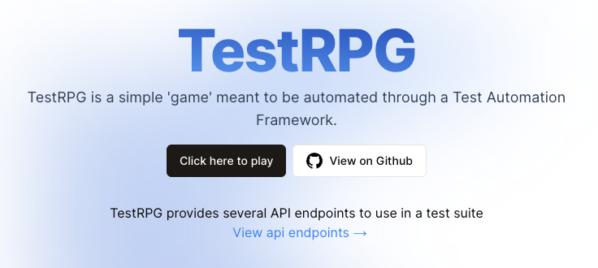
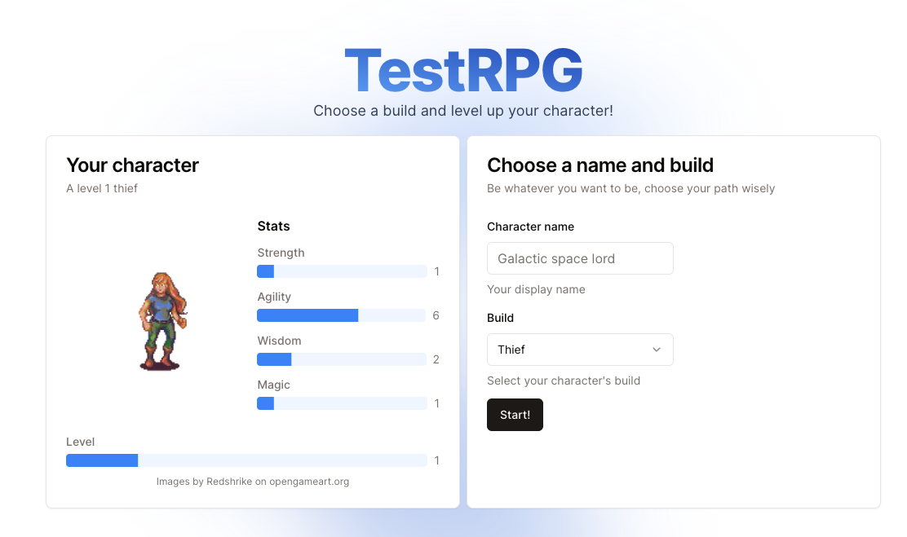
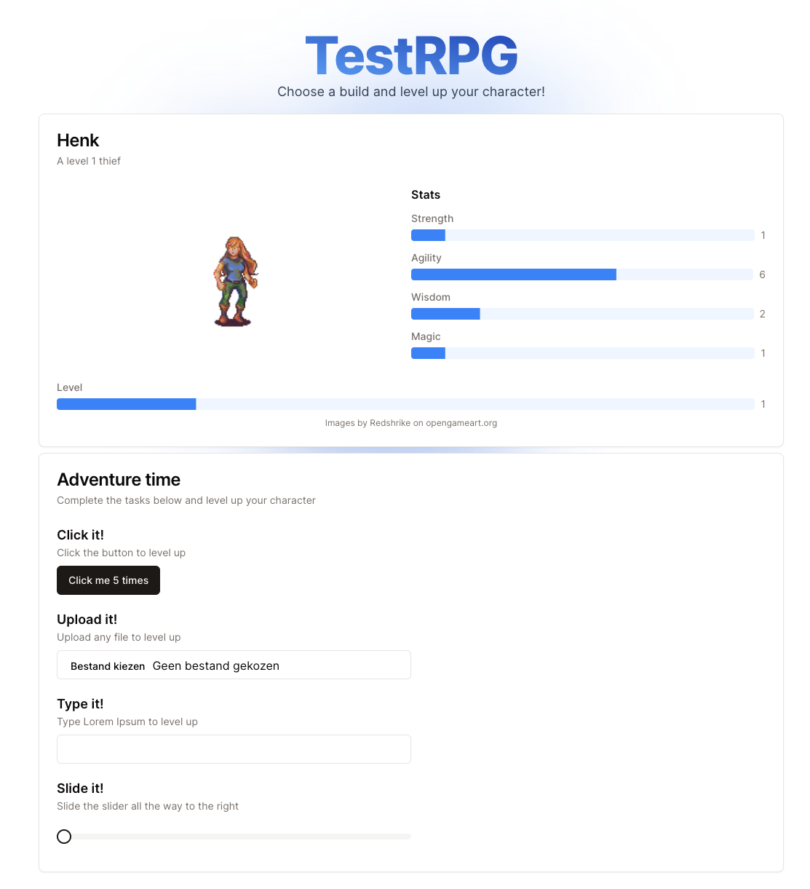
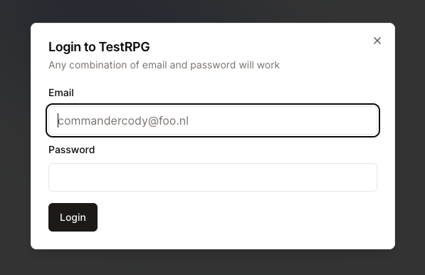

# Testplan - TestRPG Regressietest

> **Geautomatiseerde frontend regressietest voor TestRPG web applicatie**  
> Framework: Robot Framework + Browser Library | Datum: 26 oktober 2025

---

## 1. Applicatie Overzicht

**TestRPG** is een web-gebaseerde game waarbij spelers een karakter creëren en door het voltooien van taken levels behalen (max level 5).

🌐 **URL**: https://test-rpg.vercel.app  
🔌 **REST API**: https://test-rpg.vercel.app/api

---

### 📱 Scherm 1: Intro Scherm

- Welkomstbericht met "Click here to play" knop

---

### 👤 Scherm 2: Character Creation

- Character naam invoer (minimaal 3 karakters)
- Build selectie dropdown (Thief, Mage, etc.)
- Start knop

---

### 🎮 Scherm 3: Main Gameplay

**Vier taken voor level progression:**
1. **Level 1 → 2**: Klik 5x op knop
2. **Level 2 → 3**: Upload bestand
3. **Level 3 → 4**: Typ "Lorem Ipsum"
4. **Level 4 → 5**: Beweeg slider naar rechts

---

### 🔐 Scherm 4: Login

- Email validatie (@ met tekst ervoor/erna + suffix)
- Wachtwoord veld (mag niet leeg zijn)
- Login/Logout functionaliteit

---

### 🔌 REST API Endpoints

**TestRPG** biedt een REST API voor het ophalen van character builds en statistieken:

**`GET /api/builds`**
- Retourneert lijst van beschikbare character builds
- Response: Parameters

**`GET /api/builds/{buildName}`**
- Retourneert specifieke build informatie
- Parameter: buildName (Thief, Knight, Mage, Brigadier)
- Response: Build met stats

---

## 2. Testaanpak

### 2.1 Character Creation Validatie
**Negatieve tests:**
- ❌ Leeg naam veld → verwacht foutmelding
- ❌ Naam < 3 karakters → verwacht foutmelding

**Positieve test:**
- ✅ Geldige naam (≥3 karakters) + build selectie → verwacht navigatie naar gameplay

### 2.3 Gameplay Flow Testing
Voor elke taak (Level 1-5):
- Verifieer initiële status (level tekst, avatar, stats)
- Voer taak uit
- Controleer success message
- Verifieer level up (tekst, avatar, stats)

**Edge cases bij text input:**
- Incorrecte tekst ("Lorem ipsum")

### 2.4 Login Testing
**Negatieve tests:**
- ❌ Email zonder @ → verwacht foutmelding
- ❌ Email zonder suffix → verwacht foutmelding
- ❌ Leeg wachtwoord → verwacht foutmelding

**Positieve test:**
- ✅ Geldig email + wachtwoord → verifieer via aanwezigheid "Logout" knop

### 2.5 Reset Functionaliteit
- Test "Play Again" → verwacht return naar character creation

### 2.6 REST API Testing
**Endpoint validatie:**
- ✅ GET /api/builds → verwacht 200 status + array met 4 builds
- ✅ GET /api/builds/{buildName} → verwacht 200 status + correcte build stats
- ❌ GET /api/builds/Invalid → verwacht dat we de DLC niet hebben.

**Data validatie:**
- Verifieer de parameters in de builds die worden teruggegeven
- Controleer dat het totale aantal skillpoints correct berekend zijn (max 10)

---

## 3. Toegepaste TMAP Testtechnieken

### 📋 3.1 Beslissingstabeltesten
Gebruikt voor character creation validatie met combinaties van:
- Naam lengte (leeg / <3 / ≥3 karakters)
- Build selectie (geselecteerd)

### 🔄 3.2 State Transition Testing
Gameplay progression: Level 1 → 2 → 3 → 4 → 5
- Verifieer state veranderingen (avatar, tekst, stats)
- Test reset via "Play Again"

### 3.3 API Contract Testing
REST API endpoints worden getest op:
- Correcte status code
- Juiste parameters (weapon, armor etc.)
- Correct aantal skillpoints

### 🔍 3.4 Exploratory Testing
- Lange character namen (>15 karakters) ->  UI breekt bij teveel karakters
- Bestand upload zonder restricties -> significante beveiligingsrisico
- Wachtwoord met 1 karakter -> te makkelijk om te breken

---

## 4. Testdekking Regressietest

**De geautomatiseerde regressietest** dekt de volgende onderdelen:

**Frontend tests** (`regressietest/.FE/FE.robot`):
- ✅ Navigatie & schermverificatie (TC001)
- ✅ Login validatie met beslissingstabeltesten (TC002)
- ✅ Character creation met negatieve en positieve flows (TC003)
- ✅ Gameplay flow voor alle 5 levels met state transitions (TC004)
- ✅ Reset functionaliteit via "Play Again"

**REST API tests** (`regressietest/.REST/REST.robot`):
- ✅ GET /api/builds endpoint validatie (TC001)
- ✅ GET /api/builds/{buildName} per build validatie (TC002)
- ✅ 404 error handling voor ongeldige build naam (TC003)
- ✅ Data checks (skillpoints, builds, response codes)

**Bevindingen uit Exploratory Testing**
- 🔎 UI doet het niet goed meer bij character namen die 15 karakters of meer hebben
- 🔎 Zwakke wachtwoord validatie (1 karakter is toegestaan)
- 🔎 Ongevalideerde bestand upload (security risico)

---

## 5. Bevindingen & Aanbevelingen

### 🔴 Beveiligingsrisico's

**Issue 1: Ongevalideerde Bestand Upload**
- **Risico**: XSS aanvallen, malware uploads, server toegang
- **Aanbeveling**: Whitelist toevoegen voor bestanden, limiet op de grootte, scannen voor malware

**Issue 2: Zwakke Wachtwoord Vereisten**
- **Risico**: Zeer onveilig (1 karakter = geldig)
- **Aanbeveling**: Minimaal 10 karakters, 1 hoofdletter, 1 cijfer, 1 speciaal karakter

---

### 🟡 UI/gameplay Issues

**Issue 3: Character Naam Lengte**
- **Probleem**: Geen maximale lengte → UI breekt bij >15 karakters
- **Aanbeveling**: Max 15 karakters OF automatische line breaks

**Issue 4: Brigadier Build Skillpoints Overschrijding**
- **Probleem**: Brigadier build heeft 11 total skillpoints, terwijl maximum 10 is
- **Aanbeveling**: Herbalanceer Brigadier stats naar 10 total skillpoints
---

### 🟢 Could Haves

**Issue 5: Login zonder Toegevoegde Waarde**
- **Probleem**: Inloggen biedt geen functionaliteit
- **Aanbeveling**: Voeg leaderboard toe OF verwijder login feature

---

**Datum**: 26 oktober 2025  
**Auteur**: Tristan Weber

